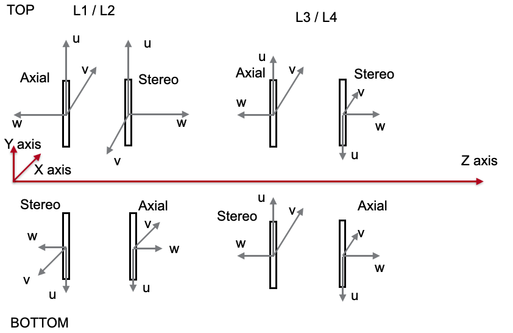
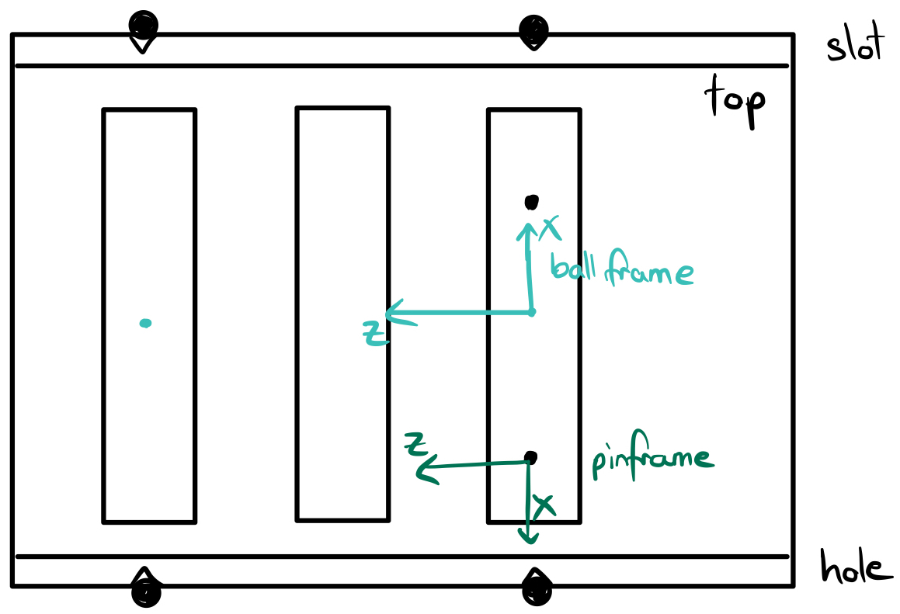
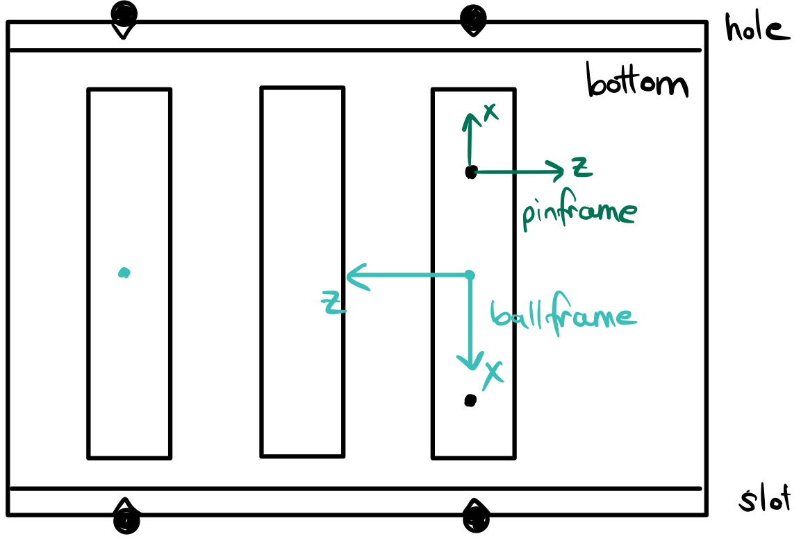
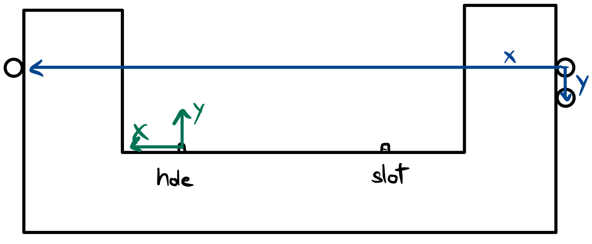

.. _background:

Background
==========
Page with general background information about tracking and alignment.

UVW Coordinates
---------------
The sensor-local coordinates are labeled UVW and are different from the
global XYZ coordinates by a translation and rotation. The rotations are
mostly small deviations from parallel or antiparallel.

Front
^^^^^

Back
^^^^
.. image:: _static/uvw-coord-back.png
   :width: 600
   :alt: Diagram Showing UVW Coordinates for Back of Detector

UChannel Ball and Pin Frames
----------------------------

Top
^^^

Bottom
^^^^^^

Fixture Ball and Pin Frames
---------------------------

