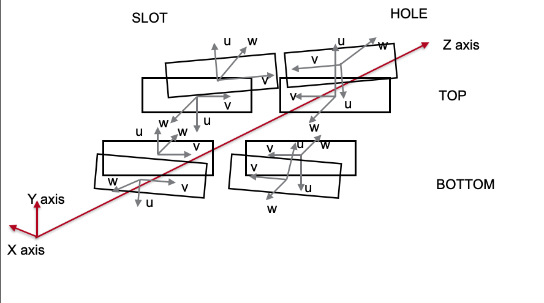

Survey Data Conversion
======================

.. automodule:: hps_align.survey
   :exclude-members: SensorEdge, Wire
   :members:
   :undoc-members:
   :show-inheritance:
   :private-members:

Coordinate Systems
------------------
To include the survey measurements in the alignment, they need to be converted to the correct coordinate systems. 
The following classes and functions are used to do this.

The Uchannel has two coordinate systems, the ball frame and the pin frame which differ for top and bottom, see images below.

Ball Frame
^^^^^^^^^^
.. automodule:: hps_align.survey._ballframe
   :exclude-members: MattBallFrame
   :members:
   :undoc-members:
   :show-inheritance:
   :private-members:

Pin Frame
^^^^^^^^^
To construct the pin frame, the base plane and pins are needed.

Base Planes
"""""""""""
.. automodule:: hps_align.survey._baseplanes
   :members:
   :undoc-members:
   :show-inheritance:
   :private-members:

Pins
""""
.. automodule:: hps_align.survey._pins
   :members:
   :undoc-members:
   :show-inheritance:
   :private-members:

Pin Frame
"""""""""
.. automodule:: hps_align.survey._pinframe
   :members:
   :undoc-members:
   :show-inheritance:
   :private-members:

UChannel
^^^^^^^^
.. automodule:: hps_align.survey._uchannel
   :members:
   :undoc-members:
   :show-inheritance:
   :private-members:

Fixture
^^^^^^^
The fixture also has a pin and a ball frame, see image below. It is important to note that the pin frame is analogous to the pin frame of the UChannel, but the ball frame is different.

.. image:: _static/fixture.png
   :width: 600
   :alt: Diagram Showing Ball and Pin Frame Coordinate Systems for Fixture

.. automodule:: hps_align.survey._fixture
   :exclude-members: ShoFixture
   :members:
   :undoc-members:
   :show-inheritance:
   :private-members:

Sensors
^^^^^^^
The sensor-local coordinates are labeled UVW and are different from the
global XYZ coordinates by a translation and rotation. The coordinate systems are different in the front and back as well as top and bottom of the SVT, see images below.

Front
^^^^^
.. image:: _static/uvw-coord-front.png
   :width: 600
   :alt: Diagram Showing UVW Coordinates for Front of Detector

Back
^^^^

.. automodule:: hps_align.survey._sensors
   :members:
   :undoc-members:
   :show-inheritance:
   :private-members:

Special Coordinate Systems
--------------------------
In the past, the coordinate system has occasionally been changed during the measurement of the survey data. The following classes and functions are used to convert the data from these special coordinate systems.

Matt Ball Frame
^^^^^^^^^^^^^^^
Special ball frame class for Matt Solt's measurement data.

.. automodule:: hps_align.survey._ballframe
   :exclude-members: BallFrame
   :members:
   :undoc-members:
   :show-inheritance:
   :private-members:

Sho Fixture
^^^^^^^^^^^
Special fixture class to use Sho's measurement data.

.. automodule:: hps_align.survey._fixture
   :exclude-members: Fixture
   :members:
   :undoc-members:
   :show-inheritance:
   :private-members:

Matt Fixture
^^^^^^^^^^^^
Special fixture class to use Matt Solt's measurement data.

.. automodule:: hps_align.survey._mattfixture
   :members:
   :undoc-members:
   :show-inheritance:
   :private-members:

Matt Sensor
^^^^^^^^^^^
Special sensor class to use Matt Solt's measurement data.

.. automodule:: hps_align.survey._mattsensor
   :members:
   :undoc-members:
   :show-inheritance:
   :private-members:

Survey Data
-----------
Using the different reference frames, the survey classes convert the measurement data and print the results in the correct format for hps-java alignment constants.

.. automodule:: hps_align.survey._survey
   :members:
   :undoc-members:
   :show-inheritance:
   :private-members:

Utility Functions
-----------------
Parser
^^^^^^
The parser is used to read the survey data from the files.
.. automodule:: hps_align.survey._parser
   :members:
   :undoc-members:
   :show-inheritance:
   :private-members:

Utils
^^^^^
.. automodule:: hps_align.survey._utils
   :members:
   :undoc-members:
   :show-inheritance:
   :private-members:
